# Final Assessment: Touch Me Not (Complete)

*Fill out the following workbook with information relevant to your project.*

*Markdown reference:* [https://guides.github.com/features/mastering-markdown/](http://guides.github.com/features/mastering-markdown/)

## Interaction flowchart ##
*Draw a flowchart of the interaction process in your project. Make sure you think about all the stages of interaction step-by-step. Also make sure that you consider actions a user might take that aren't what you intend in an ideal use case. Insert an image of it below. It might just be a photo of a hand-drawn sketch, not a carefully drawn digital diagram. It just needs to be legible.*

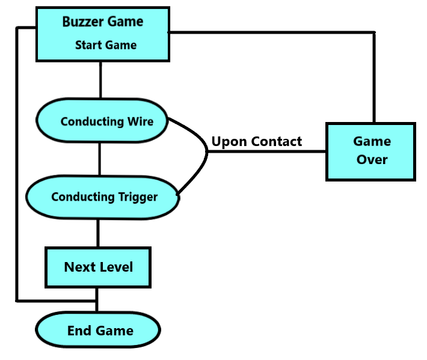

## Process documentation ##

## Part 1 ##

*The concept of building toys had always piqued my interest. Although children's toys may look easy to make because some look really plain in nature but the concept and thinking behind every toy making is complex and structured. My goal for the final project is to create a buzzer game with slight modification by installing the element of rotation to it.*

*This project documentation will cover the steps or measures I took for producing the outputs which would include all failed attempts for my project. The toy is a rotating buzzer game fundamentally at it's core.*

*The cylinder is what I will be using for the rotation game. The cyclinder will be installed in an upright, vertical position with a DC motor attached to the bottom at the base of the cylinder. The center of the base has an incision hole, wide as the circumference as the axis of the motor. Then I tried directly inserting the axis into the incision hole of the base. As expected my attempt failed when I tried rotating it.*

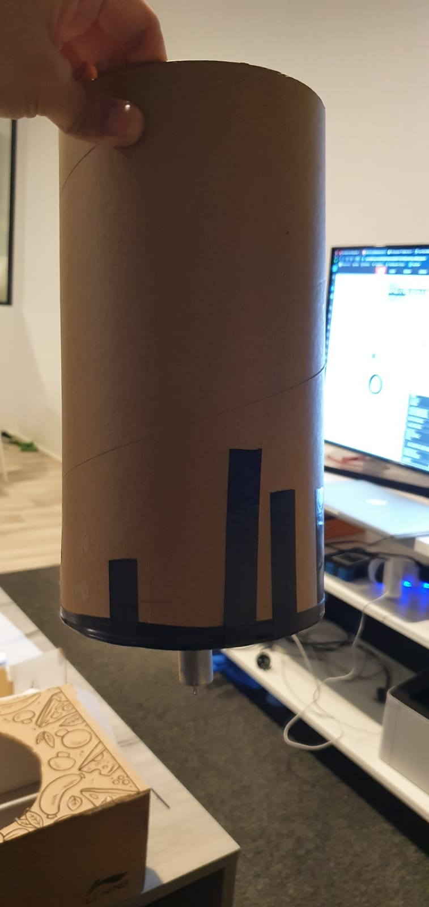

*The next step is basically to attach a new base as the previous base was ruined with the incision becoming wider and the motor unable to rotate the cylinder. So I cut another circular base with the same circumference. Keeping the thickness of the base in mind as well, the new base was slightly more thicker to the previous base. Now all that was left for the new, thicker base to be attached to the cylinder.*

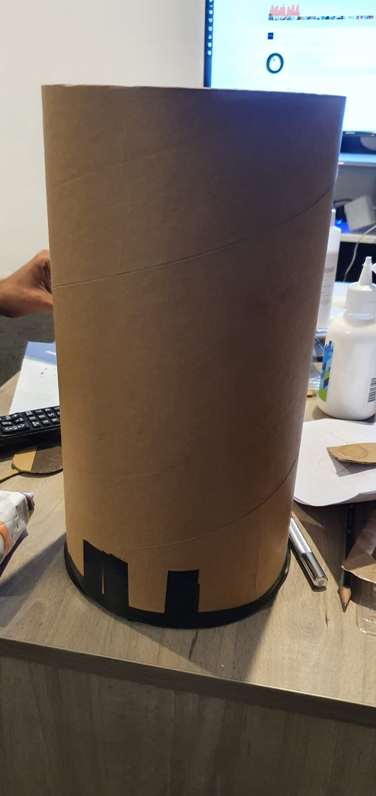

*To prevent the tumbling rotation, I came up with an idea to use a shoe box as a platform to install the motor and the cylinder. I firmly taped the DC motor to the base of the shoebox.*

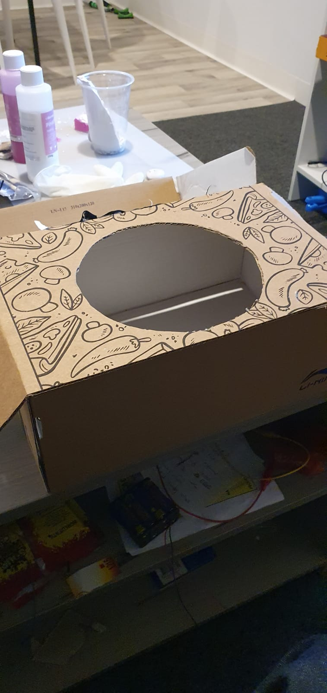

Whilst the motor was firmly attached to the base of the shoebox, the axle of the cylinder wasn't. So the cylinder tipped off balance when the motor started to rotate and fell right of the axle. Then I came up with several ways that would help fix the problem. 

The first method I tried was to tape the axle of the motor with the base of the cylinder. Result: It ended up failing as the axle started rotating the tape instead.

Since the incision I made for the axle ended up gettting bigger, I had to cut off the base of the cylinder again and had to cut another base as well. For second method, I planned to make the base of the cylinder as thick as the legth of the axle of the cylinder. So I cut about 5 bases of the same radius and taped them together with the cylinder. This time, for the top most cylinder base, I purposely did not create an incision as to make sure the axle would be able to rotate it. Result: It failed agian.

For my third try, I also used hot glue gun and PVA ( poly vinyl acetate) to bind the axle of the motor more firmly to the cylindrical base. I left it to dry for a few hours and tried rotating the cylindrical base again but it failed.

Finally it struck me. This plan would take some days but I had a gut feeling that it just might work. I had clay. Properties of the clay was that it would be a little sticky (like tape) but would harden if left to dry for a day on anything it is stuck on. Now I decided to make a volcanic like structure solely made out of clay with half the radius of the cylindrical base. In the volcanic opening of the clay, I put in super glue and immediately fitted the axle of the motor in the hole and left it for a whole day and a half to dry. 

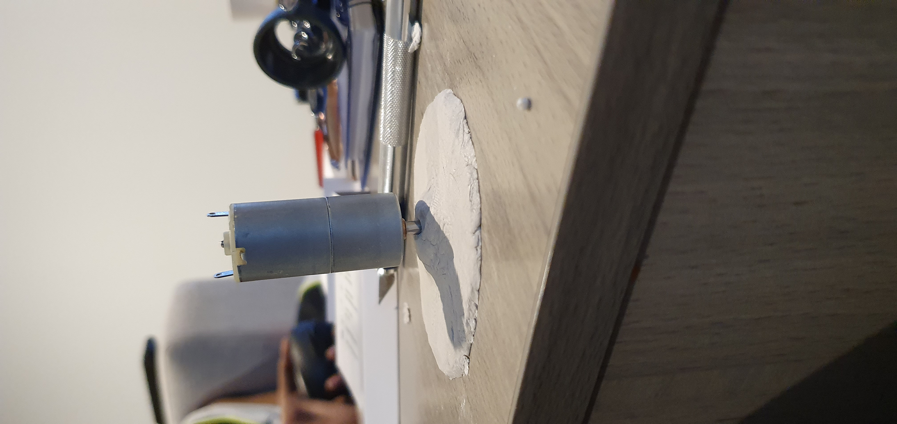

I took a cylindrical base with the axle hole incision and stuck it with the colcanic clay structure. On the other side of the cylinder, I covered the incision hole with another circular clay mass and taped the cylindrical top to it. I left it for another whole day and a half to dry up.

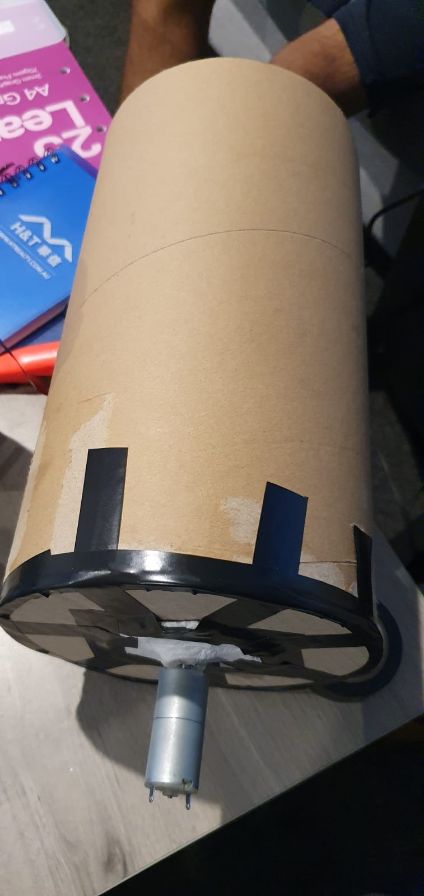

Finally I assembled the cylindrical installlation with the base and tested the rotation of the cylinder with my fingers crossed. Guess what, I finally got the installation to start rotating.

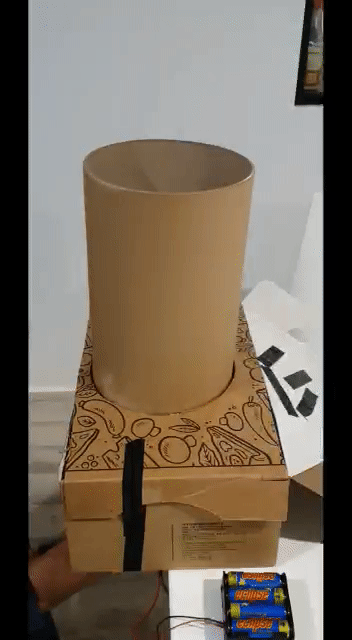

## Part 2 ##

Now for the second part, that is, to integrate the game with the cylinder rotation. Before integrating, I started to disassemble the protoype and started to paint the cylinder and station with black and red acryllic paint respectively. I also cut a maze made out of foil paper, the length of the maze similar to the circumference of the cylinder, and stuck it to the cylinder using PVA glue.

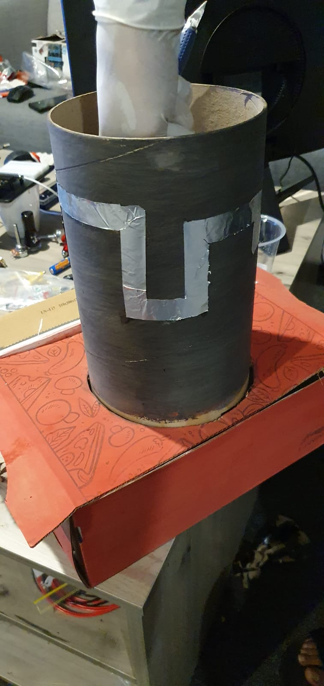

Now to test the conductivity of the maze, I used a simple LED glow test. I used the following diagram for reference.

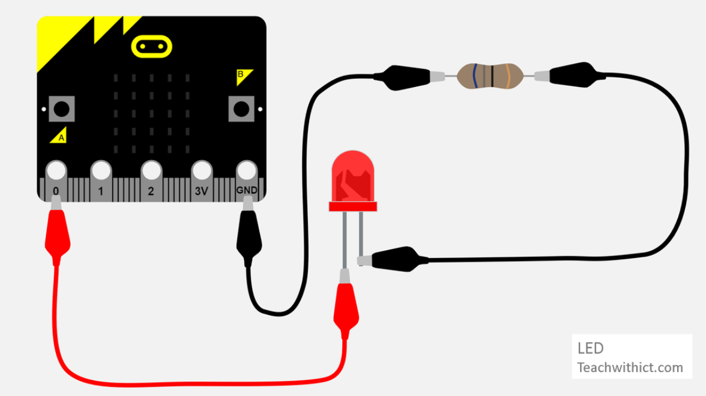

By studying the above diagram, I took two wires, positive and negative respectively, and touched them to the foil maze of the cylinder. The LED lit up indicating that the circuit of conductivity is possible.

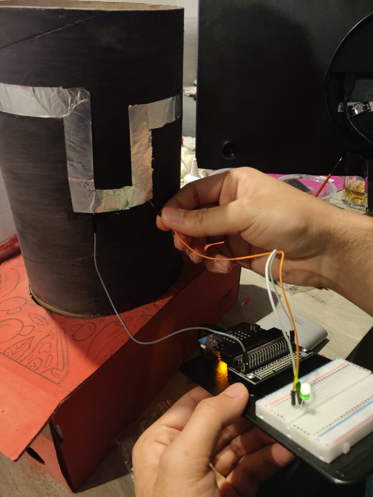

Now to code the game, I used a microbit and the website makecode.microbit.org and created the following code in it. I downloaded the code in my PC. 

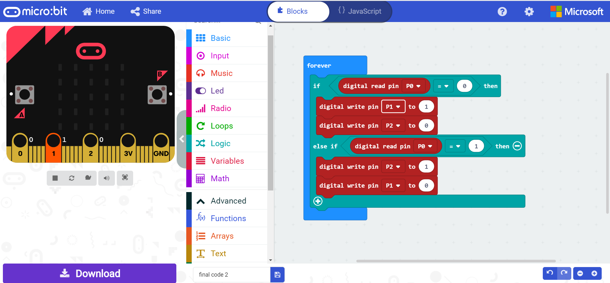

Afterwards I copied the code into the microbit and made the connections respectively. Using Pin P0 as the game trigger, the circuit only completes when P0 is able to get 3V signal. To test it, I used two LEDs Red and Green. Red would indicate that 3V pin is not in contact with the P0 pin and Green would indicate otherwise. The pins I used to connect with the Red and Green LEDs were P1 and P2 respectively according to the code I generated. The connections were made on a bread board and the test ran successful.

Now coming back to the rotation of the cylinder, the cylinder was rotating quite fast for the game to be played. To slow down the rotation of the DC motor, one could use a potentiometer and control the flow of voltage to the DC motor and therefore control the speed of the motor respectively. The connection between the potentiometer and DC motor is shown in the below image.

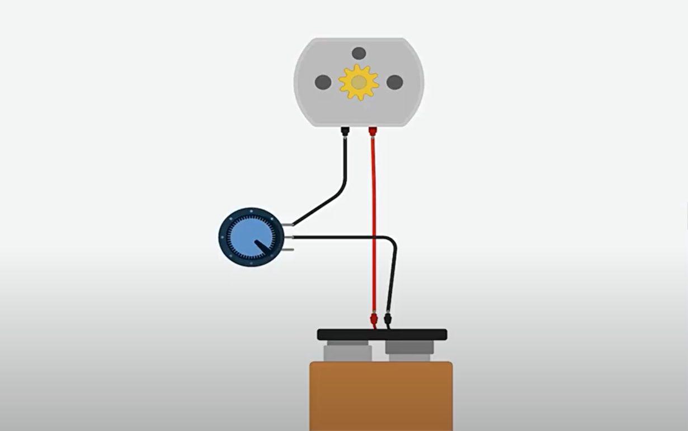

I used a 1M ohm variable resistor / potentiometer since only that was available at the time. Due to it's low sensitvity, the speed control using the potentiometer proved to be extremely difficult. A potentiometer of 100K ohm would be suitable for a 12V DC motor.
Anyways I managed to slow down or completely halt the rotation using the potentiometer.

After completing the rotation control, I finally made the final connections. I attached a foil sheet at the bottom of cylinder that would be in constant connection with the wire emerging from 3V pin of the microbit. I made another extending wire that was originating from P0 that would be used by the player to play the game. The level of difficulty would be controlled using the potentiometer. Red light would indicate game over and green would indicate that game is ongoing.

## Project outcome ##

Initially, I got the prototype to rotate on the axle of the DC motor after 3 unsuccessful attempts. Then after the 4th successful attempt, I got on with the second part of the project which was the game implementation. This part was fairly easy when compared to the initial stages. I had the code and ccircuit ready for the game to be played and rotation control. The link to the game is shown below.

https://youtu.be/wT2qiDDsxRY

## Reflection ##

I had almost given up hope, there were many times I felt I should come up with other ideas that I could still create and make it work but I kept telling myself to not give up on it. With keeping minimum budget and less facilities that were available to me due to the recent Covid-19 situation, I tried to make use of what was there around me. Also I realised that some steps require a lot of time and then must be implemented for it to work. I also realised that working on projects with another person in the room would leave open to many suggestions that I would give or receive. 
The project could have been enhanced further by incorporating 3D printing and laser cuttting. Instead of using parts from Pizza boxes, shoeboxes and Toilet rolls, parts could have been 3-D printed. Laser cutting would have also allowed for precise cuts and attaching these two techniques combined would have reduced my time on building the protoype.
With guidance from my proffessor, I had decided to use a foil maze instead of a wire maze as time was running short. The wire maze would have been a better option but sometimes the project we intend to make do not always go as intended. The initial project intention was quite contrasting from the final project. Given time, resources and facilities, I could have made the project better but again because of the Covid 19 situation, I did not possess the tools necessary to make one. It was truly fun to spend time on this project as even though I was a bit frustrated with failed outcomes, the journey I had of taking up and implementing new techniques to make my project fun is the main intention of this subject. 
As they say "It is the little detours we take along the journey, that we enjoy the most, rather than the destination itself."

