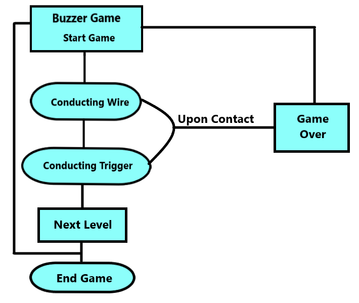
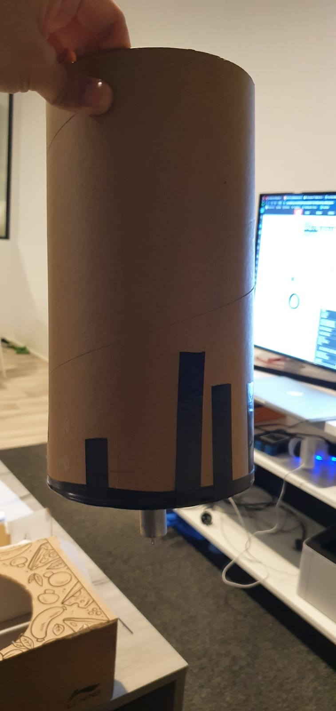
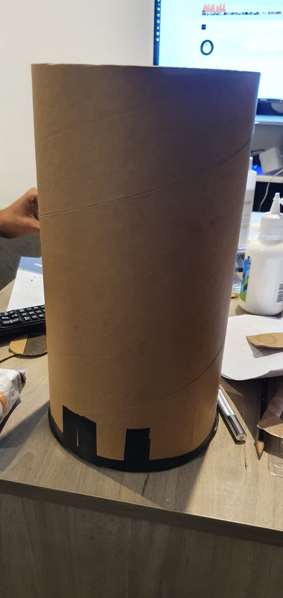
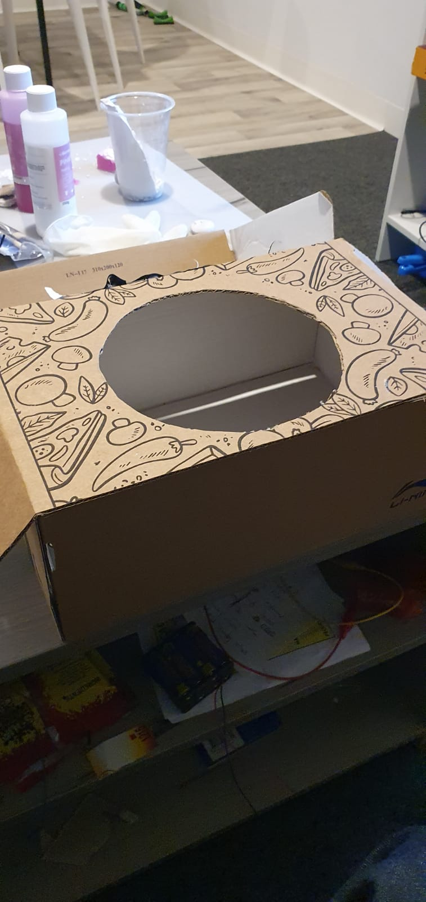

# Final Assessment: Around the world

*Fill out the following workbook with information relevant to your project.*

*Markdown reference:* [https://guides.github.com/features/mastering-markdown/](http://guides.github.com/features/mastering-markdown/)

## Interaction flowchart ##
*Draw a flowchart of the interaction process in your project. Make sure you think about all the stages of interaction step-by-step. Also make sure that you consider actions a user might take that aren't what you intend in an ideal use case. Insert an image of it below. It might just be a photo of a hand-drawn sketch, not a carefully drawn digital diagram. It just needs to be legible.*

## Process documentation

*The concept of building toys had always piqued my interest. Although children's toys may look easy to make because some look really plain in nature but the concept and thinking behind every toy making is complex and structured. My goal for the final project is to create a buzzer game with slight modification by installing the element of rotation to it.*

*This project documentation will cover the steps or measures I took for producing the outputs which would include all failed attempts for my project. The toy is a rotating buzzer game fundamentally at it's core.*

*The cylinder is what I will be using for the rotation game. The cyclinder will be installed in an upright, vertical position with a DC motor attached to the bottom at the base of the cylinder. The center of the base has an incision hole, wide as the circumference as the axis of the motor. Then I tried directly inserting the axis into the incision hole of the base. As expected my attempt failed when I tried rotating it.*

*The next step is basically to attach a new base as the previous base was ruined with the incision becoming wider and the motor unable to rotate the cylinder. So I cut another circular base with the same circumference. Keeping the thickness of the base in mind as well, the new base was slightly more thicker to the previous base. Now all that was left for the new, thicker base to be attached to the cylinder.*

*To prevent the tumbling rotation, I came up with an idea to use a shoe box as a platform to install the motor and the cylinder. I firmly taped the DC motor to the base of the shoebox.*

## Project outcome ##

*Complete the following information.*

### Project title ###

### Project description ###

*In a few sentences, describe what the project is and does, who it is for, and a typical use case.*

### Showcase image ###

*Try to capture the image as if it were in a portfolio, sales material, or project proposal. The project isn't likely to be something that finished, but practice making images that capture the project in that style.*

### Additional view ###

*Provide some other image that gives a viewer a different perspective on the project such as more about how it functions, the project in use, or something else.*

### Reflection ###

*Describe the parts of your project you felt were most successful and the parts that could have done with improvement, whether in terms of outcome, process, or understanding.*

*What techniques, approaches, skills, or information did you find useful from other sources (such as the related projects you identified earlier)?*

*What ideas have you read, heard, or seen that informed your thinking on this project? (Provide references.)*

*What might be an interesting extension of this project? In what other contexts might this project be used?*
