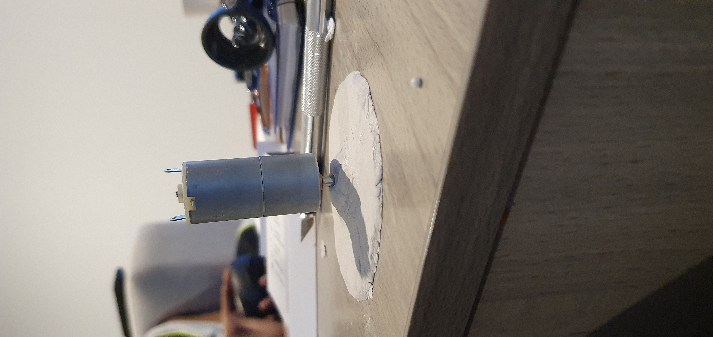

# Final Assessment: Touch Me Not (Part 1)

*Fill out the following workbook with information relevant to your project.*

*Markdown reference:* [https://guides.github.com/features/mastering-markdown/](http://guides.github.com/features/mastering-markdown/)

## Interaction flowchart ##
*Draw a flowchart of the interaction process in your project. Make sure you think about all the stages of interaction step-by-step. Also make sure that you consider actions a user might take that aren't what you intend in an ideal use case. Insert an image of it below. It might just be a photo of a hand-drawn sketch, not a carefully drawn digital diagram. It just needs to be legible.*

## Process documentation

*The concept of building toys had always piqued my interest. Although children's toys may look easy to make because some look really plain in nature but the concept and thinking behind every toy making is complex and structured. My goal for the final project is to create a buzzer game with slight modification by installing the element of rotation to it.*

*This project documentation will cover the steps or measures I took for producing the outputs which would include all failed attempts for my project. The toy is a rotating buzzer game fundamentally at it's core.*

*The cylinder is what I will be using for the rotation game. The cyclinder will be installed in an upright, vertical position with a DC motor attached to the bottom at the base of the cylinder. The center of the base has an incision hole, wide as the circumference as the axis of the motor. Then I tried directly inserting the axis into the incision hole of the base. As expected my attempt failed when I tried rotating it.*

*The next step is basically to attach a new base as the previous base was ruined with the incision becoming wider and the motor unable to rotate the cylinder. So I cut another circular base with the same circumference. Keeping the thickness of the base in mind as well, the new base was slightly more thicker to the previous base. Now all that was left for the new, thicker base to be attached to the cylinder.*

*To prevent the tumbling rotation, I came up with an idea to use a shoe box as a platform to install the motor and the cylinder. I firmly taped the DC motor to the base of the shoebox.*

Whilst the motor was firmly attached to the base of the shoebox, the axle of the cylinder wasn't. So the cylinder tipped off balance when the motor started to rotate and fell right of the axle. Then I came up with several ways that would help fix the problem. 

The first method I tried was to tape the axle of the motor with the base of the cylinder. Result: It ended up failing as the axle started rotating the tape instead.

Since the incision I made for the axle ended up gettting bigger, I had to cut off the base of the cylinder again and had to cut another base as well. For second method, I planned to make the base of the cylinder as thick as the legth of the axle of the cylinder. So I cut about 5 bases of the same radius and taped them together with the cylinder. This time, for the top most cylinder base, I purposely did not create an incision as to make sure the axle would be able to rotate it. Result: It failed agian.

For my third try, I also used hot glue gun and PVA ( poly vinyl acetate) to bind the axle of the motor more firmly to the cylindrical base. I left it to dry for a few hours and tried rotating the cylindrical base again but it failed.

Finally it struck me. This plan would take some days but I had a gut feeling that it just might work. I had clay. Properties of the clay was that it would be a little sticky (like tape) but would harden if left to dry for a day on anything it is stuck on. Now I decided to make a volcanic like structure solely made out of clay with half the radius of the cylindrical base. In the volcanic opening of the clay, I put in super glue and immediately fitted the axle of the motor in the hole and left it for a whole day and a half to dry. 

I took a cylindrical base with the axle hole incision and stuck it with the colcanic clay structure. On the other side of the cylinder, I covered the incision hole with another circular clay mass and taped the cylindrical top to it. I left it for another whole day and a half to dry up.

Finally I assembled the cylindrical installlation with the base and tested the rotation of the cylinder with my fingers crossed. Guess what, I finally got the installation to start rotating.

## Project outcome & Reflection ##

I finally got the prototype to rotate on the axle of the DC motor after 3 unsuccessful attempts. I had almost given up hope, there were many times I felt I should come up with other ideas that I could still create and make it work but I kept telling myself to not give up on it. With keeping minimum budget and less facilities that were available to me due to the recent Covid-19 situation, I tried to make use of what was there around me. Also I realised that some steps require a lot of time and then must be implemented for it to work. I also realised that working on projects with another person in the room would leave open to many suggestions that I would give or receive. It was truly fun to spend time on this project as even though I was a bit frustrated with failed outcomes, the journey I had of taking up and implementing new techniques to make my project fun is the main intention of this subject. 
As they say "It is the little detours we take along the journey, that we enjoy the most, rather than the destination itself."
